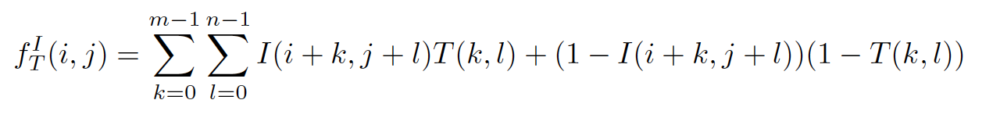
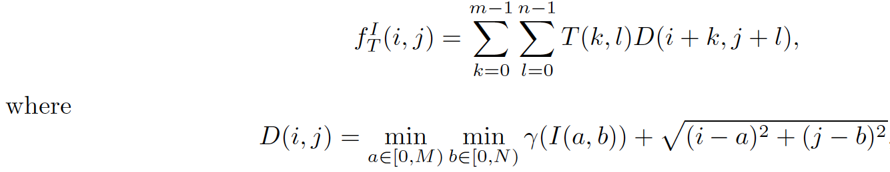
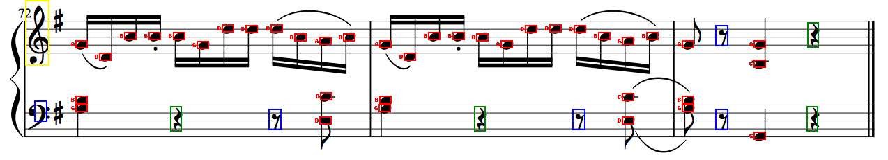
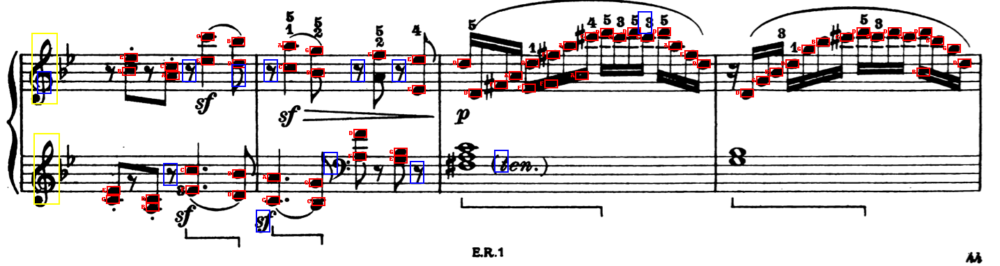
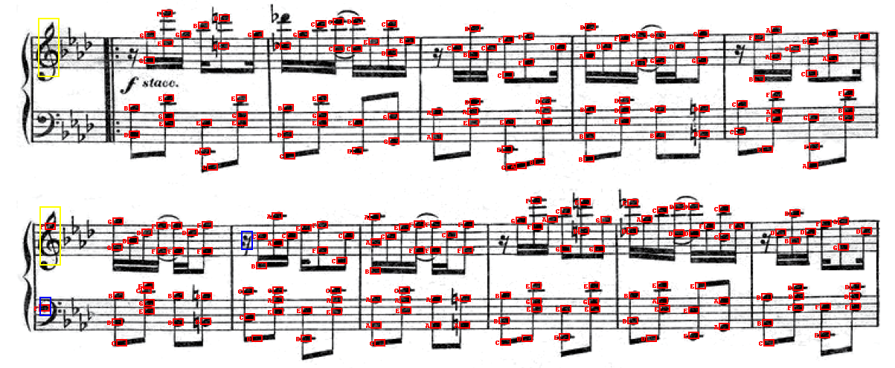
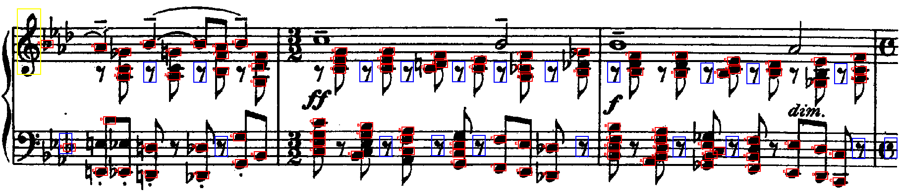
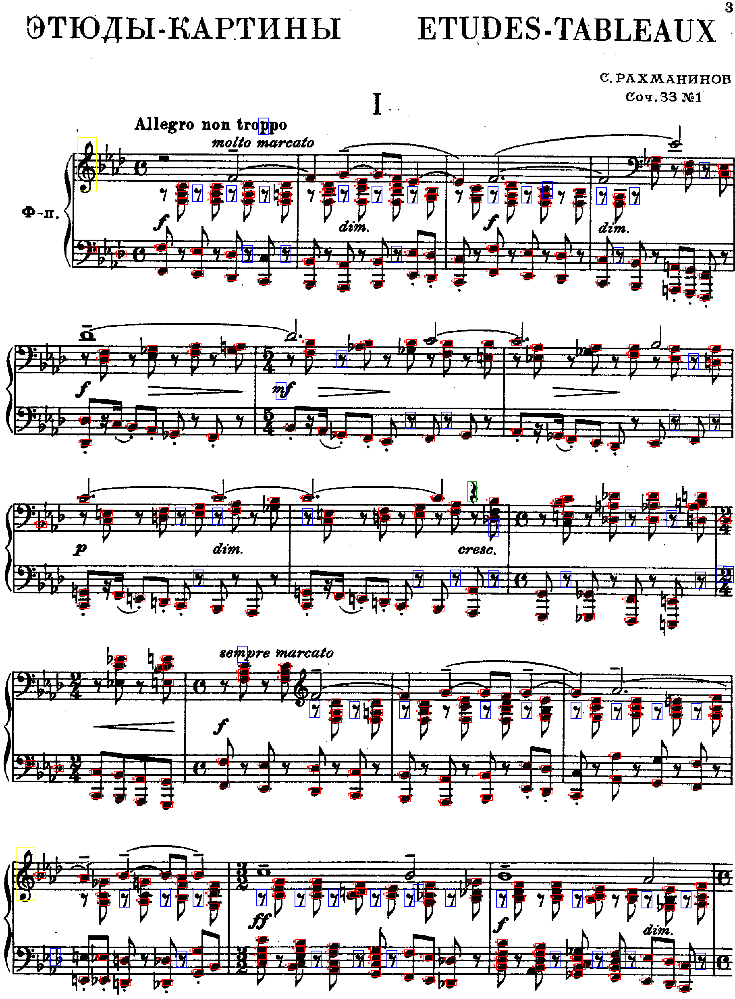
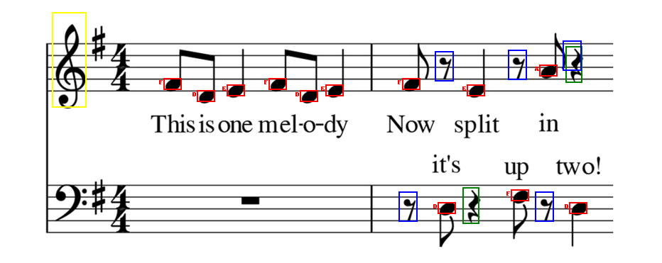

#  Optical Music Recognition 

User Name : hrajash, jp109, mmanurn, vanshah

## How to run the code : 

```
./omr2.py <image_file>

image file and template1, template2, template3, template4.png should be inside the same directory with omr2.py
detection.py, hough.py, pitch.py should be in the same directory also
```

### Goal : Here, our goal is to classify the notes, quarter rests and eighth rests in the scanned images of documents into textual representations

Our model has these 5 design components : 

```
1) Convolution
2) Getting a similarity score of each slice in an image with the template. This is done through the following methods :
	-> Hamming Distance 
	-> Edge maps 
	-> Sobel + Hamming
3) Hough Transform  
4) Classifying whether the notes are lower staff or upper staff/pitch detection
5) Non-maximal suppression
```

# 1) Convolution

Here in this component we are convoluting the template on the image. But before convoluting we have padded the image with a blank. We have done padding of size (height_template//2 , width_template//2). 
We have chosen such a size because we don't want any loss of information on the edges of the image. Hence we have done extra padding of zeros on the above mentioned size. 
In this step we will repeatedly convolute on the image with 5 templates as the filters. Hence, we will have to do convolution 5 times with all templates differently.
(Note : We have added templates, 4 and 5 additionally to classify whether the given sets of 5 lines belong to upper staff or lower staff).
We flip the filter here so as to do convolution. If we don't flip the filter and multiply as it is then we will be doing correlation and not convolution. 

# 2) Getting a similarity score of each slice in an image with the template.

Here, before classifying the templates we need to define some similarity index or threshold so that while convoluting if we get a similarity score around that then we can classify that slice of the image as some particular template. 

The thresholds for each template was decided by getting a baseline of similarity when we do a similarity check of template with the template in hamming distance method. Once we have this baseline, using trial and error we came up with the thresholds for all the templates individually which minimizes False positives.

Now to get the similarity index we have implemented three methods : 

### 2.1) Hamming Distance 

Counting the number of pixels that disagree between the image and the template binary images. After doing some algebra, the equation was reduced to convolution of image with (2*Template - 1)



### 2.2) Edge Maps

In this method we have implemented a sobel operator and used separable convolution. We have done this through implementation of concurrent Breadth First Search. In this method we convert our image as well as template into edge detected images using sobel operator and after that we try to find the similarity score using the template scoring function. In this we multiply distance matrix we get from BFS with the Template. First we push the location of coordinates wherever we find 1 in the Queue. Then we take the neighbours of each 1 which are zeros and add it in the Queue. For every zero we calculate the Euclidean distance with the nearest 1 and if we get an already visited zero then we take the minimum euclidean distance to the nearest 1. This operation was done using quadratic time [O(n*logn)]. This is just an approximation to the distance matrix as BFS considers Manhattan distance while finding the nearest 1. This was done to avoid the overhead of running four loops to calculate the distance matrix.




### 2.3) Sobel + Hamming 

In this method we passed the image through sobel filter and did the same as 2.1

### 2.4) Observations : 

```
-> 2.1: Is able to classify Template1 and Template 2.
-> 2.2: Is not able to classify any of the templates correctly (various threshols tested). 
-> 2.3: Is able to classify Template 3 and Template 4.
```

# 3) Hough Transform

We use this method to get the scale of the image as well as to get the starting positions of each five lines. The Hough voting space has two dimensions: the row-coordinate of the first line of the staff, and the spacing distance between the staff lines. Each pixel in the image then “votes” for a set of row-coordinates and spacing parameters. Each peak in this voting space then corresponds to the row-coordinate and spacing of a staff line, which in turn tells us where each of the five lines of the staff is located. Peaks were discovered by iterating argmax upto some threshold.

To find the spacing between the lines we take the maximum number of votes a specific space between lines has got. The spacing was used as a scaling factor for images to match the template.

### Errors and how we resolved it :

We noticed three things from the data sets;
1. the lines were not perfectly horizontal
2. not all lines started from the beginning of the sheet
3. It was taking a long time when running on big images

So instead of making all the pixels vote for the horizontal lines, we have made only limited number of pixels in the middle(width-wise) of the image to vote. This produced a better and faster result.

Also, because the image has some noise, there was a problem where the same line was being voted for more than one line. This was a problem because then the program would assume there are two lines in the same place. We have made changes so that after finding argmax line coordinate, the code changes all similar lines to 0. Since we have a threshold when choosing which lines are plausible, the lines would not be considered again.


# 4)Classifying the type of pitch

We extracted the line starting symbols from the image and scaled it. We did this in order to classify whether the following pitch belongs to the upper staff or to the lower staff. The start symbol of the higher pitch is Template4 and the start symbol for lower pitch is Template5. Hence we created 2 more templates, template4 and template5 which will be used to classify upper and lower staff. The pitch of the nodes were named based on the identification of the upper or lower staff template. We found difficulties while finding threshold for template5, hence we found the location of template4 and for template 5 we just took a complement to find lower staffs.

Using the row coordinates of the upper staff symbol, if the start of the line was within certain threshold in distance to the upper staff symbol, we gave it a certain sequence of pitch. Lower staff lines got a different sequence of pitch. Then, starting from some point above the first line and to some point below the fifth line, the code iterated 0.5 space between lines every time. The pitch was lowered every iterations.

# 5) Non-maximal suppression

When we looked at the output based on the thresholds, there were many matchings for the template which are very close to each other. Hence it was creating multiple matchings of the nodes in the near by template dimensions. To avoid this, we calculated the euclidean distance of every identified nodes in the image. If Euclidean distance was less than 5, then we removed those extra nodes that were matched with the image. In this way were correctly able to identify only one box for each nodes in the image.

# Accuracy

We were able to detect around 80% of the nodes with minimal False Positives in the images. When there are overlapping of nodes with nodes or wiht any other pixels, the templates had a tendency to not detect that part, since the threshold value was higher. If we try reducing the threshold, then many False Positives used to be detected. Major challenge was in finding template3 which had both node and lines in the template which was not the case in test images. Hence when we used sobel and then hamming we were able to remove some of the background lines and then calculate the similarity score. Many places we were unable to detect template3 which caused the downfall in the accuracy.

# Additional Bonus work

We created 2 more templates (template4 and template5) which were used to differentitate between treble staff and base staff. We identified this because the node namings are dependant on these clefs. We tried identifying both template4 and template5, but template5 used to generate lot of false positives. Hence we identified template4 and took a complement of it to detect template5. Template4 is marked in yellow in the test images.

We also tried running on couple of other images from the internet and it was producing good results. The file music5.png is the out of sample test set we used to see how it performs on the new images.

# Test Results 

Music1.png


		
Music2.png



Music3.png



Music4.png



Rach.png



## Out of sample test image

Music5.png




 

 
